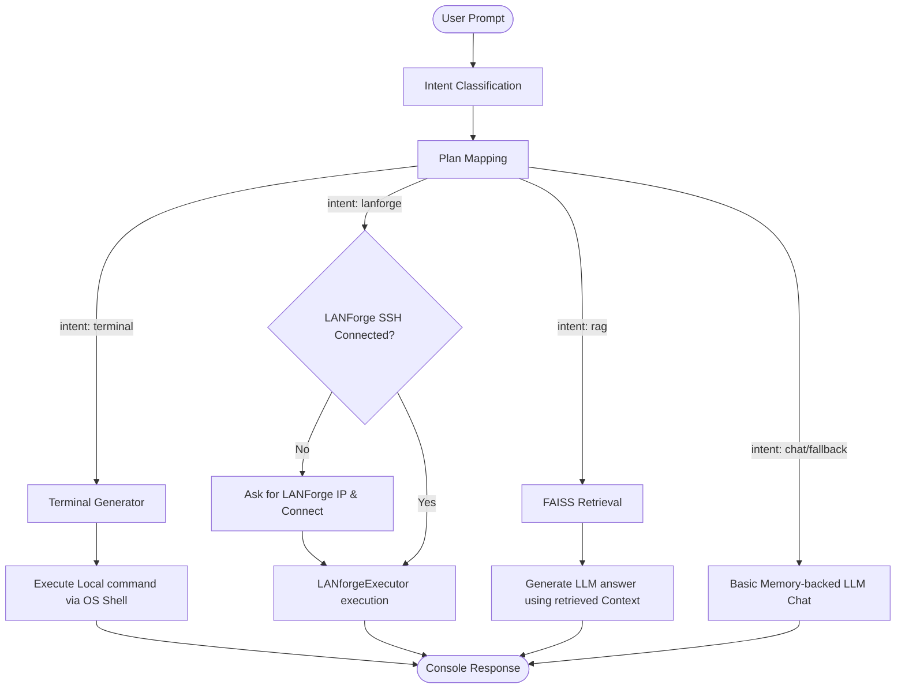
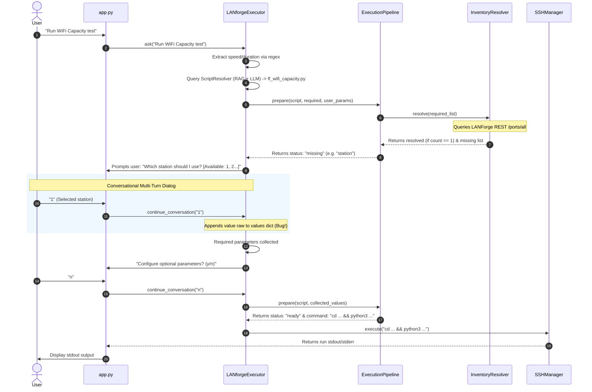

# LANForge AI Project Architecture Analysis Report

This report provides a detailed breakdown of the existing architecture, subsystems, pipelines, and technical debt in the LANForge AI repository.

---

## 1. Project Directory Tree

The directory tree of the workspace is organized as follows:

```text
LanForge_AI/
│
├── agent/                         # Core agent logic and state machine
│   ├── __init__.py
│   ├── ai_agent.py                # AIAgent coordinator
│   ├── command_builder.py         # Assembles script args into run commands
│   ├── conversation.py            # Holds multi-turn script-arguments state
│   ├── conversation_manager.py    # Generates user prompts for missing inputs
│   ├── conversation_state.py      # Flat container for current execution state
│   ├── entity_extractor.py        # Regex extractor for IP, speed, duration (UNUSED)
│   ├── execution_engine.py        # Core executor coordinator (STUB)
│   ├── execution_pipeline.py      # orchestrates inventory resolution -> collection -> building
│   ├── execution_runner.py        # Runner helper (STUB)
│   ├── executor.py                # Command execution mapper for local shell (UNUSED)
│   ├── intent_classifier.py       # Rule + LLM-based intent classifier
│   ├── inventory_resolver.py      # Auto-resolves/filters inventory dependencies
│   ├── json_helper.py             # JSON utility (STUB)
│   ├── lanforge_executor.py       # Orchestrator for LANForge script execution & multi-turn dialogs
│   ├── memory.py                  # Standard chat session memory wrapper
│   ├── option_selector.py         # Splits and parses comma selections (UNUSED)
│   ├── output_explainer.py        # Explains run results (STUB)
│   ├── parameter_collector.py     # Aggregates values and identifies missing ones
│   ├── parameter_extractor.py     # Regex extractor for duration and speed
│   ├── parameter_planner.py       # LLM planner to discover required params dynamically
│   ├── parameter_questions.py     # Preset questions dictionary for parameter collection
│   ├── parameter_resolver.py      # Local resolver helper (STUB)
│   ├── planner.py                 # Maps intents to pipeline tools
│   ├── resource_ranker.py         # Naming heuristics scoring for radios, stations, ethernet
│   ├── resource_selector.py       # Console helper to select resources by index
│   ├── router.py                  # Router executing plan steps (redundant terminal execution)
│   ├── runtime.py                 # Data model for connection state & interface lists
│   ├── runtime_manager.py         # REST connection to LANForge /ports/all parsing
│   ├── script_resolver.py         # RAG + LLM script name matching
│   ├── selection_parser.py        # Resolves indexes to actual values (UNUSED)
│   ├── session.py                 # Session class wrapper (STUB)
│   ├── session_manager.py         # Session management container (STUB)
│   └── terminal_generator.py      # LLM terminal command generator
│
├── parser/                        # Static code AST analysis framework
│   ├── __init__.py
│   ├── alias_normalizer.py        # Alias resolution helper (STUB)
│   ├── analyzer.py                # Aggregates AST parsing (Args, Imports, Classes, Functions)
│   ├── argument_enricher.py       # Maps argument destinations to inventory adapter properties
│   ├── argument_parser.py         # AST parser for argparse.add_argument configurations
│   ├── dependency_parser.py       # Dependency parsing (STUB)
│   ├── documentation_generator.py # Documentation generation helper (STUB)
│   ├── execution_analyzer.py      # Infers required args by scanning "args.x" checks in AST
│   ├── extract_arguments.py       # Command line extraction entry point (STUB)
│   ├── import_parser.py           # Extracts script import statements via AST parsing
│   ├── knowledge_builder.py       # Generates knowledge/knowledge.json by scanning scripts
│   ├── metadata_builder.py        # Runs MetadataEnricher and generates metadata.json
│   ├── metadata_enricher.py       # Enriches argument details with value types & resolvers
│   ├── multiple_detector.py       # Infers multi-value support from args.x.split() or nargs in AST
│   ├── repository_crawler.py      # Crawler configuration (STUB)
│   ├── repository_scanner.py      # Scans folders for python scripts
│   ├── requirement_inference.py   # Required argument inference coordinator (STUB)
│   └── scan_repository.py         # Crawler script (STUB)
│
├── knowledge/                     # Script knowledge base
│   ├── aliases/                   # Directory containing alias text files (RAG source)
│   │   └── station_aliases.txt
│   ├── commands/                  # Directory containing command run descriptions (RAG source)
│   │   └── create station.txt, run_dataplane.txt, etc.
│   ├── concepts/                  # Concept text files (RAG source)
│   │   └── dataplane_testing.txt
│   ├── dependencies/              # Dependency documentation text files (RAG source)
│   │   └── dataplane_dependencies.txt
│   ├── examples/                  # Examples text files (RAG source)
│   │   └── examples.txt (0 bytes)
│   ├── parameters/                # Parameter description files (RAG source)
│   │   └── station.txt, upstream_port.txt
│   ├── scripts/                   # Script description text files (RAG source)
│   │   └── lf_dataplane_test.txt
│   ├── ai_metadata.json           # Sample metadata file for lf_dataplane_test.py
│   ├── ai_metadata_builder.py     # Generates ai_metadata.json (hardcoded to lf_dataplane_test.py)
│   ├── aliases.txt                # Consolidated text files list
│   ├── canonical_parameters.json.txt
│   ├── canonical_parameters.txt
│   ├── context_builder.py         # Combines parser metadata and script source code for LLM context
│   ├── dependencies.json.txt
│   ├── examples.txt
│   ├── glossary.txt
│   ├── knowledge.json             # Large compiled AST dump of all python script structures
│   ├── metadata.json              # Argument enriched data version of knowledge.json
│   ├── reports.txt
│   ├── script_dependencies.txt
│   └── script_descriptions.txt
│
├── prompts/                       # LLM Prompt Templates (all empty files)
│   ├── command_generation.txt     # (0 bytes)
│   ├── explanation.txt            # (0 bytes)
│   ├── intent.txt                 # (0 bytes)
│   └── planner.txt                # (0 bytes)
│
├── rag/                           # Retrieval-augmented generation module
│   ├── database/                  # ChromaDB folder (UNUSED/Abandoned)
│   ├── database.py                # ChromaDB vector collection connector (UNUSED)
│   ├── embedder.py                # Ollama embeddings connector using 'nomic-embed-text'
│   ├── index.faiss                # FAISS serialized vector database
│   ├── indexer.py                 # Script to construct and write the FAISS database index
│   ├── ingest.py                  # ChromaDB ingestion pipeline (broken import, UNUSED)
│   ├── metadata.json              # Serialized documents mapped to index offsets for FAISS
│   ├── retriever.py               # FAISS document retriever logic
│   └── search.py                  # ChromaDB querying logic (UNUSED)
│
├── metadata_generator/            # LLM semantic parser (not integrated into main loop)
│   ├── output/                    # JSON output directory
│   ├── generate_metadata.py       # Iterates over scripts to write semantic metadata files
│   ├── llm.py                     # Ollama Client adapter (points to gpt-oss:20b)
│   ├── prompt.py                  # Human-like semantic metadata generation prompts
│   └── schema.py                  # Schema definitions (STUB)
│
├── app.py                         # Interactive CLI loop entry point
├── config.py                      # Configurations: Ollama host, LANForge settings, System Prompt
├── hello.py                       # Test script
├── requirements.txt.txt           # Dependency specifications
└── test_*.py                      # Unit test files in workspace root
```

---

## 2. Entry Points

The project contains several operational entry points:
1. **Interactive Dialog/Execution Loop**: [app.py](file:///c:/Users/Amaresh.Koti/Documents/LanForge_AI/app.py) runs the user console interface, parses initial commands, routes queries to `AIAgent`, tracks multi-turn script arguments, and prints output.
2. **Static Knowledge Base Generation**: 
   - `parser/knowledge_builder.py` is invoked to compile raw AST metadata from LANForge scripts into `knowledge/knowledge.json`.
   - `parser/metadata_builder.py` compiles `knowledge/metadata.json`.
3. **Semantic LLM Enrichment**: [metadata_generator/generate_metadata.py](file:///c:/Users/Amaresh.Koti/Documents/LanForge_AI/metadata_generator/generate_metadata.py) runs a secondary offline LLM parsing process on all scripts, outputting schema-enforced semantic specifications to `metadata_generator/output/`.
4. **Vector Database Re-indexing**: [rag/indexer.py](file:///c:/Users/Amaresh.Koti/Documents/LanForge_AI/rag/indexer.py) scans text documents in `knowledge/` and constructs the FAISS vector index (`rag/index.faiss`) using the `nomic-embed-text` model.

---

## 3. Agent Pipeline

When a user submits a query to the agent, the processing flow is handled sequentially inside `AIAgent.ask(self, question)`:



---

## 4. Intent Detection

1. **Keyword Phase**: The `IntentClassifier` first checks if any hardcoded keyword matches the user query:
   - **lanforge**: e.g., `"run dataplane"`, `"run wifi"`, `"wifi capacity"`, `"run script"`.
   - **rag**: e.g., `"what is"`, `"explain"`, `"meaning"`, `"define"`, `"parameter"`, `"arguments"`.
   - **terminal**: e.g., `"run "`, `"execute "`, `"cmd"`, `"powershell"`, `"ls"`, `"ping"`.
   - **report**: e.g., `"report"`, `"summary"`, `"latency"`, `"throughput"`.
   - **inventory**: e.g., `"show stations"`, `"show radios"`, `"inventory"`.
2. **LLM Fallback Phase**: If no keywords match, the agent issues an Ollama chat query (`qwen2.5:3b-instruct`) with a classification system prompt instructing it to return exactly one word corresponding to the classified intent.

---

## 5. Script Selection

The matching of user intent to a specific script is conducted inside `ScriptResolver.resolve(self, question)`:
1. It queries the FAISS index (`Retriever.search(question, top_k=3)`) to extract the top 3 relevant documents.
2. It filters these documents to keep only those residing in `commands` or `scripts` subdirectories.
3. It builds a prompt containing the retrieved file contents and instructs the LLM to identify the target script.
4. The LLM must reply with a structured JSON format: `{"script": "lf_dataplane_test.py", "confidence": 0.95, "reason": "..."}`.

---

## 6. Script Execution Flow

The sequence to prepare, resolve parameters for, and run a LANForge script:



---

## 7. REST API Modules

LANForge REST calls are integrated via two overlapping components:
1. **`RuntimeManager`**: Connected dynamically during agent execution. Queries `GET http://{host}:8080/ports/all` to populate lists of interface types (`ethernet`, `stations`, `radios`) in `LANForgeRuntime`.
2. **`tools/inventory.py`**: A redundant class `Inventory` that similarly queries `GET http://{host}:8080/ports/all` but uses regular expressions on resource aliases (`"sta"` for stations, `"wiphy"` for radios) to categorize interfaces.

---

## 8. Knowledge Generation Pipeline

This background pipeline indexes scripts to build static resources for RAG and script parsing:

```text
               ┌──────────────────────┐
               │  Repository Scripts  │
               └──────────┬───────────┘
                          │ (rglob *.py)
               ┌──────────▼───────────┐
               │  RepositoryScanner   │
               └──────────┬───────────┘
                          │
               ┌──────────▼───────────┐
               │    ScriptAnalyzer    │
               └────┬───────────────┬─┘
                    │               │
  ┌─────────────────▼─────────┐    ┌▼────────────────────────┐
  │     ArgumentParser        │    │    ExecutionAnalyzer    │
  │ (parse argparse.arg_stmt) │    │ (parse AST condition   │
  └─────────────────┬─────────┘    │  checks for required)  │
                    │              └┬────────────────────────┘
                    │               │
                    └───────┬───────┘
                            │
               ┌────────────▼─────────┐
               │   MultipleDetector   │
               │ (parse splits & nargs│
               └────────────┬─────────┘
                            │
               ┌────────────▼─────────┐
               │   ArgumentEnricher   │
               │ (assigns resolvers)  │
               └────────────┬─────────┘
                            │
               ┌────────────▼─────────┐
               │  knowledge.json      │
               └──────────────────────┘
```

The resulting `knowledge.json` is fed into two sub-branches:
1. **Metadata Builder**: Builds `knowledge/metadata.json` for mapping value types and resolving adapter methods.
2. **FAISS Indexing**: Reads text documentation (e.g. `knowledge/commands/*.txt`) and uses `Embedder` with `nomic-embed-text` via Ollama to generate `rag/index.faiss`.

---

## 9. Session/Context Handling

1. **State Persistence**: Tracked globally in `AIAgent.executor.conversation`.
2. **Interactive Routing**: In `app.py`, if `agent.executor.conversation.active` is `True`, all user answers are routed directly to `continue_conversation(question)` instead of starting a new evaluation loop.
3. **Session Reset**: Once execution completes (or fails), `conversation.reset()` is invoked to clear current parameters.

---

## 10. Prompt Files

The project has a folder structure `prompts/` dedicated to template management containing:
- `command_generation.txt`
- `explanation.txt`
- `intent.txt`
- `planner.txt`

> [!WARNING]
> **All of these files are currently empty (0 bytes)**.
> All prompt templates are hardcoded directly into the python codebase (e.g. `SYSTEM_PROMPT` in `config.py`, prompts in `IntentClassifier`, `ScriptResolver`, `ParameterPlanner`, `TerminalGenerator`, and `AIMetadataBuilder`).

---

## 11. Existing State Management

State structures are maintained in two memory classes:
- **`ConversationState`**: Container for execution models. Holds the target script name, parameters dict, execution metadata, and wait-state.
- **`Conversation`**: The dialog state machine. Tracks `self.stage` (`"required"`, `"optional_confirm"`, `"optional_select"`, `"optional_value"`), list of arguments, values dictionary, index of the current missing argument, options list for the user to choose from, and validation flags.

---

## 12. Existing Inventory/Discovery Logic

- **Entity Identification**: When a parameter resolver (e.g. `stations`) is mapped, the system queries the active `RuntimeInventoryAdapter`. It collects available keys (like ports `1.1.eth0`, `1.1.wlan0`).
- **Resource Ranker**: Scans collected resource IDs and orders them:
  - Ethernet ports containing `".eth"` get `+100` points; those starting with `"1.1"` get `+50` points; WAN adapters (`"rmnet"`, `"umts"`) get `-100` points.
  - Radios/stations starting with `"1.1"` or containing `"wiphy"` are prioritized.
- **Auto-Resolution**: If the ranking returns a list containing exactly one element, the system auto-resolves that parameter without prompting the user.

---

## 13. Existing LANForge Communication Layer

- **Control Layer**: REST calls executed using the `requests` library. Port `8080` is queried to fetch structural network hardware state.
- **Execution Layer**: SSH execution handled via the `paramiko` library. Commands are sent to port `22` with hardcoded credentials `lanforge` / `lanforge`.

---

## 14. Technical Debt Observed

> [!IMPORTANT]
> A thorough analysis of the codebase reveals several critical flaws, missing integrations, and bugs:

1. **Option Selection Bug (Resolution Failure)**: 
   - `OptionSelector` and `SelectionParser` are written but **never imported or invoked** in the conversation loop. 
   - When `app.py` asks a user to select an option (e.g., selecting `"1"` for station `1.1.sta0`), the raw user input `"1"` is added directly to `self.values`. 
   - This results in invalid command arguments being passed to the LANForge script (`--station 1` instead of `--station 1.1.sta0`), which will crash the script execution on the manager.
2. **Unused / Dead Code**:
   - `agent/executor.py` containing the `Executor` class is completely unused.
   - `agent/entity_extractor.py` is imported and instantiated as `self.entity_extractor` inside `LANforgeExecutor.__init__` but never used.
   - `tools/router.py` lists methods like `run_lanforge`, `run_rag`, `run_inventory` that simply return `"not implemented"` because the agent handles these branches inline inside `AIAgent.ask()`.
3. **Parameter Leakage Bug**:
   - In `ParameterCollector.collect(self, execution, user_values)` (located in [agent/parameter_collector.py](file:///c:/Users/Amaresh.Koti/Documents/LanForge_AI/agent/parameter_collector.py)), `self.values` is defined as an instance attribute (`self.values = {}` in `__init__`) and is updated but **never cleared** between runs. 
   - This causes parameter values from previous runs to leak into subsequent script execution planning.
4. **Incorrect Ingest RAG Setup**:
   - `rag/ingest.py` and `rag/search.py` use ChromaDB and attempt to import `rag.embed` (which does not exist, as the file is named `embedder.py`). This code is completely broken.
   - The production agent code uses `rag/retriever.py` which depends on FAISS.
5. **Metadata Generation Loop Bug**:
   - In [metadata_generator/generate_metadata.py](file:///c:/Users/Amaresh.Koti/Documents/LanForge_AI/metadata_generator/generate_metadata.py), the script loops over `knowledge.items()` to extract scripts. 
   - However, `knowledge.json` is a dict with top-level keys `"repository"`, `"total_scripts"`, and `"scripts"`. 
   - The loop should iterate over `knowledge["scripts"].items()`, meaning the generator will crash or miss target scripts.
6. **Hardcoded AI Metadata Builder**:
   - `knowledge/ai_metadata_builder.py` is hardcoded to only generate AI metadata for `lf_dataplane_test.py`. It cannot handle other scripts without rewriting code.

---

## 15. Recommended Extension Points WITHOUT Modifying Code

Because of the rules prohibiting source code modifications at this stage, the following extension points are available purely by modifying data, documentation, and config files:

1. **Populating Vector DB Documents**: 
   - New capabilities, script documentation, custom parameters, and argument descriptions can be added as `.txt` files in `knowledge/commands/`, `knowledge/scripts/`, `knowledge/concepts/`, etc. 
   - Running `rag/indexer.py` will rebuild the FAISS database to enable immediate retrieval improvements.
2. **Manipulating Prompt Templates**: 
   - Although the prompts in the code are currently hardcoded inline, the empty files in `prompts/` (e.g. `intent.txt`, `planner.txt`, `command_generation.txt`, `explanation.txt`) exist. 
   - If code changes are allowed in the next phase, these files are the logical placeholders to outsource prompt logic.
3. **Updating Static Knowledge Definitions**:
   - The `knowledge/knowledge.json` and `knowledge/metadata.json` files can be modified directly to alter argument rules, default choices, or link custom resolver adaptation names.
4. **Configuring Environment Properties**:
   - Connection properties (LANForge manager IP, ports, usernames) and Ollama API endpoints are decoupled in [config.py](file:///c:/Users/Amaresh.Koti/Documents/LanForge_AI/config.py) and can be modified directly to point to other models or target testbeds.
5. **Utilizing Custom Skills/Rules**:
   - Creating project-specific rules in `.agents/AGENTS.md` or introducing custom skill configurations to guide the AI agent during development.
